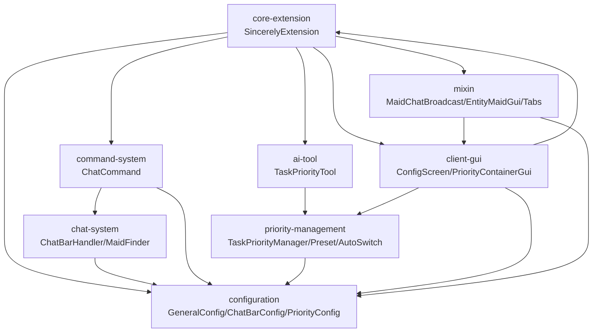
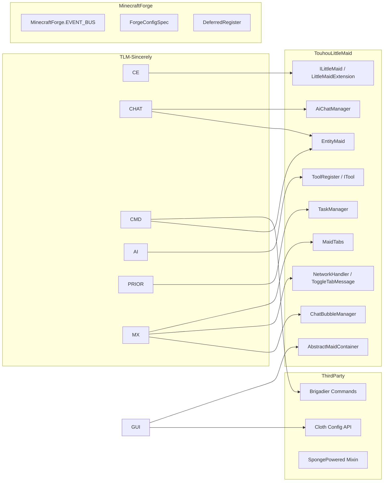

> generated_by: nexus-mapper v2
> verified_at: 2026-05-09
> provenance: AST-backed for internal imports; external API edges inferred from manual code inspection

# 依赖关系图

## 系统级依赖

## 外部 API 依赖

## 关键依赖关系说明

| 关系 | 类型 | 说明 |
|------|------|------|
| ChatBarConfig ← 5 模块 | 配置消费 | 聊天栏、命令、Mixin、GUI 均消费同一配置项集 |
| SincerelyExtension ↔ PriorityRegistry | 循环（良性） | PriorityRegistry 引用 MOD_ID 常量，Forge 标准模式 |
| ChatBarHandler → MaidFinder | 调用 | 聊天事件 → 女仆查找 → AI 对话管道 |
| TaskAutoSwitchHandler → TaskManager | 外部调用 | 服务端 tick → 任务查找 → 调用 setTask() |
| MaidChatBroadcastMixin → ChatBubbleManager | Mixin 注入 | 重定向女仆回复为广播/私聊 |

## Fan-in / Fan-out 热点

**Top Fan-in（最常被引用）**:
1. ChatBarConfig — 5 模块引用
2. PriorityConfig — 3 模块引用
3. TaskPriorityPreset — 2 模块引用
4. TaskPriorityManager — 2 模块引用

**Top Fan-out（引用最多模块）**:
1. SincerelyExtension — 6 个内部模块
2. PriorityContainerGui / ConfigScreen / ChatCommand / TaskPriorityTool / GeneralConfig — 各 2 个内部模块
